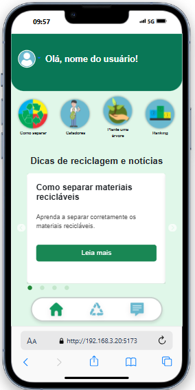
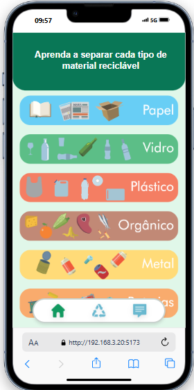
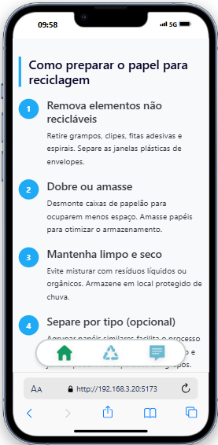

# Coletaqui

Plataforma PWA para apoiar a educação ambiental, o mapeamento de pontos de coleta, o agendamento de coletas recicláveis e a análise de impacto da reciclagem.

---

## Sobre o Projeto

O Coletaqui faz parte de uma atividade extensionista e tem como objetivo aproximar a comunidade de práticas sustentáveis.

Principais objetivos:

1. Mapear pontos de coleta de recicláveis, óleo de cozinha usado, pilhas e baterias.
2. Permitir o agendamento de coleta de materiais recicláveis.
3. Disponibilizar relatórios e dashboards para análise de impacto e eficácia da plataforma.

O projeto está organizado como um monorepo, com frontend, backend e documentação técnica no mesmo repositório.

---

## Stack Atual

Frontend:

- Angular
- Angular Router
- Angular Service Worker
- Bootstrap
- Bootstrap Icons
- TypeScript
- PWA mobile-first

Backend:

- Java 17
- Spring Boot
- Spring Web MVC
- Spring Security
- Spring Validation
- Spring Data JPA
- Hibernate
- Swagger/OpenAPI com springdoc-openapi

Banco de dados:

- PostgreSQL
- ORM com Spring Data JPA/Hibernate

Containerização:

- Docker
- Docker Compose
- Nginx para servir o frontend Angular em produção/container

Autenticação:

- Login/cadastro de usuário comum e coletor por telefone com OTP via WhatsApp
- Login administrativo separado por e-mail e senha
- Emissão de JWT para rotas protegidas

---

## Estrutura do Repositório

```text
coletaqui/
  backend/
    Dockerfile
  frontend/
    Dockerfile
    nginx.conf
  docs/
  docker-compose.yml
  LICENSE
  README.md
```

Diretórios principais:

- `backend/`: API REST em Java/Spring Boot.
- `frontend/`: frontend atual em Angular PWA.
- `docs/`: documentação técnica do projeto.
- `docker-compose.yml`: orquestra frontend, backend e PostgreSQL.

---

## Pre-visualização

### Dashboard Principal



### Dicas de Reciclagem



### Guia de Separação do Papel



---

## Como Rodar com Docker

O projeto pode ser executado com Docker Compose, subindo frontend, backend e banco de dados juntos.

```bash
docker compose up --build
```

Serviços expostos:

```text
Frontend:   http://localhost:4200
Backend:    http://localhost:8080
Swagger:    http://localhost:8080/swagger-ui/index.html
OpenAPI:    http://localhost:8080/v3/api-docs
PostgreSQL: localhost:5432
```

Acesso administrativo local:

```text
Painel admin: http://localhost:4200/admin/login
E-mail:       admin@coletaqui.local
Senha:        admin123
```

Serviços do Compose:

- `frontend`: Angular PWA compilado e servido por Nginx.
- `backend`: API Java/Spring Boot.
- `db`: banco PostgreSQL com volume persistente.

Para parar os containers:

```bash
docker compose down
```

Para parar e remover também o volume do banco:

```bash
docker compose down -v
```

---

## Como Rodar Localmente sem Docker

### Frontend Angular

```bash
cd frontend
npm install
npm start
```

Por padrão, o frontend fica disponível em:

```text
http://localhost:4200
```

### Backend Spring Boot

```bash
cd backend
./mvnw spring-boot:run
```

No Windows, também pode ser usado:

```bash
cd backend
mvnw.cmd spring-boot:run
```

Por padrão, a API fica disponível em:

```text
http://localhost:8080
```

Quando o Swagger/OpenAPI for configurado no backend, a documentação interativa da API ficará disponível em:

```text
http://localhost:8080/swagger-ui/index.html
```

O contrato OpenAPI em JSON ficará disponível em:

```text
http://localhost:8080/v3/api-docs
```

---

## Configuração de Ambiente

Variáveis sugeridas para o backend:

```text
DATABASE_URL=jdbc:postgresql://localhost:5432/coletaqui
DATABASE_USERNAME=coletaqui
DATABASE_PASSWORD=coletaqui
JWT_SECRET=alterar-em-producao
OTP_EXPIRATION_MINUTES=5
JPA_DDL_AUTO=update
APP_ADMIN_EMAIL=admin@coletaqui.local
APP_ADMIN_PASSWORD=admin123
APP_ADMIN_NAME=Administrador Coletaqui
APP_ADMIN_PHONE=00000000000
```

Em desenvolvimento, o frontend deve consumir a API em:

```text
http://localhost:8080
```

---

## Funcionalidades

Disponíveis no frontend:

- Tela inicial e fluxo de entrada.
- Login/cadastro de usuário comum e catador.
- Home mobile-first.
- Carrossel de dicas de reciclagem.
- Guias de separação por material.
- Navegação inferior fixa.
- Telas de ranking, perfil, catadores e conteúdo educativo.
- Configuração PWA.

Planejadas para próximas integrações:

- Cadastro e consulta de pontos de coleta.
- Documentação e teste das rotas via Swagger/OpenAPI.

---

## Documentação

A documentação do projeto está em:

```text
docs/
```

Arquivos principais:

- `docs/architecture.md`
- `docs/database.md`
- `docs/requirements.md`
- `docs/diagrams/`

---

## Licença

Este projeto está sob a licença [Apache 2.0](./LICENSE).

---

## Desenvolvedor

Feito por **Wirlly Silva**.

[LinkedIn](https://linkedin.com/in/wirlly-pereira/) | [GitHub](https://github.com/WirllySilva)

---

## Atualizacao Funcional

Tambem ja foram integrados:

- Listagem de coletores locais de Aracoiaba/PE.
- Cadastro do tipo de atendimento do coletor: coleta domiciliar, ponto de recebimento ou coleta + recebimento.
- Agendamento de coleta com historico e detalhe da solicitacao.
- Cancelamento de solicitacoes ainda abertas.
- Area do coletor com solicitacoes abertas, agenda, aceite e conclusao de coletas.
- Dashboard inicial de impacto do coletor com status das coletas, materiais e bairros atendidos.
- Area de ranking reservada para gamificacao dos moradores.
- Painel administrativo desktop em `/admin/login`, com dashboard geral em `/admin/dashboard`, coletores pendentes, usuarios e coletas.
- Login administrativo por e-mail e senha usando usuário `ADMIN` na tabela `users`.
