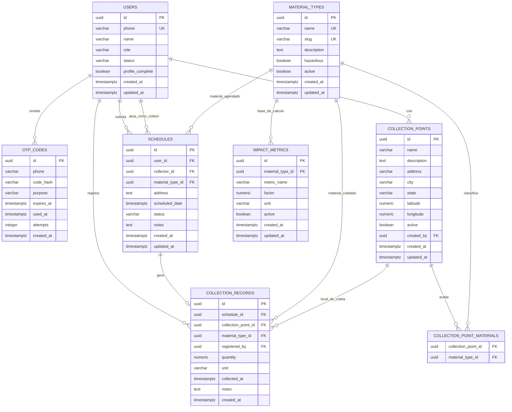

# Banco de Dados
## Projeto: Coletaqui
## Versão: 1.0
## Data: 01/07/2026

---

# 1. Visão Geral

Este documento descreve o modelo de banco de dados planejado para o Coletaqui.

O banco definido para o projeto é PostgreSQL, acessado pelo backend Java/Spring Boot por meio de ORM com Spring Data JPA/Hibernate.

O modelo foi pensado para atender aos principais objetivos do sistema:

1. Mapear pontos de coleta de recicláveis, óleo de cozinha usado, pilhas e baterias.
2. Permitir agendamento de coleta de materiais recicláveis.
3. Registrar dados para relatórios e dashboards de impacto.
4. Suportar autenticação por telefone com OTP e emissão de JWT.

---

# 2. Tecnologia e Convenções

## 2.1 Banco de Dados

- SGBD: PostgreSQL.
- Ambiente local: Docker Compose.
- Porta padrão local: `5432`.
- Banco padrão: `coletaqui`.
- Usuário padrão local: `coletaqui`.

## 2.2 ORM

- Spring Data JPA.
- Hibernate.

## 2.3 Convenções de Modelagem

- Chaves primárias preferencialmente em UUID.
- Datas em `timestamp with time zone` quando possível.
- Campos de auditoria padrão:
  - `created_at`
  - `updated_at`
- Exclusão lógica em entidades de domínio quando fizer sentido, usando `active` ou `status`.
- Enums no backend devem ter valores estáveis e legíveis.
- Entidades não devem ser expostas diretamente pela API; o backend deve usar DTOs.

## 2.4 Tipos Sugeridos

|Tipo lógico  |PostgreSQL sugerido        |Observação                                    |
|-------------|---------------------------|----------------------------------------------|
|UUID         |`uuid`                     |Pode ser gerado pela aplicação ou pelo banco  |
|Texto curto  |`varchar(n)`               |Usar tamanho conforme domínio                 |
|Texto longo  |`text`                     |Para descrições e observações                 |
|Data/hora    |`timestamp with time zone` |Preferível para auditoria e eventos           |
|Decimal      |`numeric(10,2)`            |Para pesos, volumes e métricas estimadas      |
|Booleano     |`boolean`                  |Para flags simples                            |
|Coordenada   |`numeric(10,7)`            |Latitude/longitude no MVP                     |

Observação: em evolução futura, o projeto pode usar PostGIS para consultas geográficas mais avançadas.

---

# 3. Entidades Principais

Entidades planejadas:

- `users`
- `otp_codes`
- `collection_points`
- `material_types`
- `collection_point_materials`
- `schedules`
- `collection_records`
- `impact_metrics`

Entidades de apoio recomendadas para evolução:

- `refresh_tokens`
- `audit_logs`
- `notifications`

---

# 4. Diagrama Entidade-Relacionamento

---

# 5. Descrição das Entidades

## 5.1 users

Representa usuários do sistema, incluindo usuário comum, catador/coletor e administrador.

|Campo              |Tipo sugerido |Obrigatório |Observação                                           |
|-------------------|-------------:|-----------:|-----------------------------------------------------|
|`id`               |`uuid`        |Sim         | Chave primária                                      |
|`phone`            |`varchar(20)` |Sim         | Identificador principal do usuário                  |
|`name`             |`varchar(120)`|Não         | Obrigatório após completar cadastro                 |
|`role`             |`varchar(30)` |Sim         | `COMMON_USER`, `COLLECTOR`, `ADMIN`                 |
|`status`           |`varchar(30)` |Sim         | `ACTIVE`, `PENDING_APPROVAL`, `INACTIVE`, `BLOCKED` |
|`profile_complete` |`boolean`     |Sim         | Indica se o cadastro foi finalizado                 |
|`created_at`       |`timestamptz` |Sim         | Data de criação                                     |
|`updated_at`       |`timestamptz` |Sim         | Data de atualização                                 |

Regras:

- `phone` deve ser único.
- Um telefone não deve gerar múltiplas contas independentes.
- Catador/coletor pode iniciar com `status = PENDING_APPROVAL`.
- Administrador deve ter autenticação mais forte do que OTP simples.

Cardinalidades:

- Um usuário pode possuir muitos OTPs.
- Um usuário comum pode solicitar muitos agendamentos.
- Um catador/coletor pode atender muitos agendamentos.
- Um administrador ou usuário autorizado pode criar muitos pontos de coleta.

---

## 5.2 otp_codes

Representa códigos OTP emitidos para login ou início de cadastro.

|Campo       |Tipo sugerido |Obrigatório |Observação                            |
|------------|-------------:|-----------:|--------------------------------------|
|`id`        |`uuid`        |Sim         |Chave primária                        |
|`phone`     |`varchar(20)` |Sim         |Telefone que solicitou o OTP          |
|`code_hash` |`varchar(255)`|Sim         |Hash do código OTP                    |
|`purpose`   |`varchar(30)` |Sim         |Exemplo: `AUTH`                       |
|`expires_at`|`timestamptz` |Sim         |Expiração padrão de 5 minutos         |
|`used_at`   |`timestamptz` |Não         |Preenchido após uso com sucesso       |
|`attempts`  |`integer`     |Sim         |Quantidade de tentativas de validação |
|`created_at`|`timestamptz` |Sim         |Data de emissão                       |

Regras:

- O OTP não deve ser armazenado em texto puro.
- Novo OTP invalida o anterior do mesmo telefone e finalidade.
- OTP expirado não pode ser validado.
- OTP usado não pode ser reutilizado.
- Deve existir limite de tentativas.
- Em produção, o OTP não deve ser retornado pela API.

Cardinalidades:

- Um usuário pode ter muitos registros de OTP ao longo do tempo.
- O relacionamento pode ser feito por `phone`, porque o OTP também pode ser emitido antes da criação completa do usuário.

---

## 5.3 material_types

Representa os tipos de materiais aceitos pelo sistema.

|Campo        |Tipo sugerido |Obrigatório |Observação                                     |
|-------------|-------------:|-----------:|-----------------------------------------------|
|`id`         |`uuid`        |Sim         |Chave primária                                 |
|`name`       |`varchar(80)` |Sim         |Nome exibido ao usuário                        |
|`slug`       |`varchar(80)` |Sim         |Identificador estável para rotas e integrações |
|`description`|`text`        |Não         |Descrição do material                          |
|`hazardous`  |`boolean`     |Sim         |Indica material com descarte especial          |
|`active`     |`boolean`     |Sim         |Controla se aparece no sistema                 |
|`created_at` |`timestamptz` |Sim         |Data de criação                                |
|`updated_at` |`timestamptz` |Sim         |Data de atualização                            |

Valores iniciais sugeridos:

- Papel.
- Vidro.
- Plástico.
- Metal.
- Orgânico.
- Óleo de cozinha usado.
- Pilhas.
- Baterias.

Cardinalidades:

- Um tipo de material pode estar associado a muitos pontos de coleta.
- Um tipo de material pode aparecer em muitos agendamentos.
- Um tipo de material pode aparecer em muitos registros de coleta.
- Um tipo de material pode possuir muitas métricas de impacto.

---

## 5.4 collection_points

Representa pontos de coleta disponíveis para a comunidade.

|Campo        |Tipo sugerido  |Obrigatório |Observação                   |
|-------------|--------------:|-----------:|-----------------------------|
|`id`         |`uuid`         |Sim         |Chave primária               |
|`name`       |`varchar(120)` |Sim         |Nome do ponto de coleta      |
|`description`|`text`         |Não         |Informações adicionais       |
|`address`    |`varchar(255)` |Sim         |Endereço textual             |
|`city`       |`varchar(100)` |Sim         |Cidade                       |
|`state`      |`varchar(2)`   |Sim         |UF                           |
|`latitude`   |`numeric(10,7)`|Não         |Latitude                     |
|`longitude`  |`numeric(10,7)`|Não         |Longitude                    |
|`active`     |`boolean`      |Sim         |Indica se está visível/ativo |
|`created_by` |`uuid`         |Não         |FK para `users.id`           |
|`created_at` |`timestamptz`  |Sim         |Data de criação              |
|`updated_at` |`timestamptz`  |Sim         |Data de atualização          |

Regras:

- Pontos inativos não devem aparecer em buscas públicas.
- Um ponto pode aceitar vários tipos de material.
- Latitude e longitude serão opcionais no início, mas recomendadas para mapa e geolocalização.

Cardinalidades:

- Um usuário autorizado pode criar muitos pontos de coleta.
- Um ponto de coleta pode aceitar muitos materiais.
- Um ponto de coleta pode estar relacionado a muitos registros de coleta.

---

## 5.5 collection_point_materials

Tabela associativa entre pontos de coleta e tipos de material.

|Campo                |Tipo sugerido |Obrigatório |Observação                     |
|---------------------|-------------:|-----------:|-------------------------------|
|`collection_point_id`|`uuid`        |Sim         |FK para `collection_points.id` |
|`material_type_id`   |`uuid`        |Sim         |FK para `material_types.id`    |

Chave primária sugerida:

- `collection_point_id`
- `material_type_id`

Cardinalidades:

- Um ponto de coleta aceita muitos materiais.
- Um material pode ser aceito por muitos pontos de coleta.

Relacionamento:

- `collection_points` N:N `material_types`.

---

## 5.6 schedules

Representa solicitações/agendamentos de coleta.

|Campo              |Tipo sugerido |Obrigatório |Observação                     |
|-------------------|-------------:|-----------:|-------------------------------|
|`id`               |`uuid`        |Sim         |Chave primária                 |
|`user_id`          |`uuid`        |Sim         |Usuário que solicitou a coleta |
|`collector_id`     |`uuid`        |Não         |Catador/coletor responsável    |
|`material_type_id` |`uuid`        |Sim         |Tipo principal de material     |
|`address`          |`text`        |Sim         |Endereço da coleta             |
|`scheduled_date`   |`timestamptz` |Sim         |Data/hora agendada             |
|`status`           |`varchar(30)` |Sim         |Status do agendamento          |
|`notes`            |`text`        |Não         |Observações                    |
|`created_at`       |`timestamptz` |Sim         |Data de criação                |
|`updated_at`       |`timestamptz` |Sim         |Data de atualização            |

Status sugeridos:

- `REQUESTED`
- `ACCEPTED`
- `IN_PROGRESS`
- `COMPLETED`
- `CANCELED`

Regras:

- O solicitante deve ser um usuário comum ou usuário autorizado.
- O coletor, quando definido, deve possuir perfil `COLLECTOR`.
- Agendamento concluído pode gerar um registro em `collection_records`.
- Agendamento cancelado não deve gerar registro de coleta concluída.

Cardinalidades:

- Um usuário pode solicitar muitos agendamentos.
- Um catador/coletor pode atender muitos agendamentos.
- Um material pode estar presente em muitos agendamentos.
- Um agendamento pode gerar zero ou um registro de coleta.

---

## 5.7 collection_records

Representa registros de coletas realizadas, usados para histórico, relatórios e dashboards.

|Campo                 | Tipo sugerido |Obrigatório |Observação                     |
|----------------------|--------------:|-----------:|-------------------------------|
|`id`                  |`uuid`         |Sim         |Chave primária                 |
|`schedule_id`         |`uuid`         |Não         |FK para `schedules.id`         |
|`collection_point_id` |`uuid`         |Não         |FK para `collection_points.id` |
|`material_type_id`    |`uuid`         |Sim         |FK para `material_types.id`    |
|`registered_by`       |`uuid`         |Sim         |Usuário que registrou a coleta |
|`quantity`            |`numeric(10,2)`|Não         |Quantidade coletada            |
|`unit`                |`varchar(20)`  |Não         |Exemplo: `kg`, `l`, `un`       |
|`collected_at`        |`timestamptz`  |Sim         |Data/hora da coleta            |
|`notes`               |`text`         |Não         |Observações                    |
|`created_at`          |`timestamptz`  |Sim         |Data de criação                |

Regras:

- Pode estar ligado a um agendamento, a um ponto de coleta, ou ambos.
- Deve informar o tipo de material.
- Quantidade e unidade são recomendadas para relatórios de impacto.

Cardinalidades:

- Um agendamento pode gerar zero ou um registro de coleta.
- Um ponto de coleta pode ter muitos registros de coleta.
- Um material pode estar presente em muitos registros de coleta.
- Um usuário pode registrar muitas coletas.

---

## 5.8 impact_metrics

Representa fatores de cálculo para dashboards de impacto.

|Campo              |Tipo sugerido   |Obrigatório |Observação                       |
|-------------------|---------------:|-----------:|---------------------------------|
|`id`               | `uuid`         |Sim         | Chave primária                  |
|`material_type_id` | `uuid`         |Sim         | FK para `material_types.id`     |
|`metric_name`      | `varchar(100)` |Sim         | Nome da métrica                 |
|`factor`           | `numeric(10,4)`|Sim         | Fator aplicado sobre quantidade |
|`unit`             | `varchar(30)`  |Sim         | Unidade do resultado            |
|`active`           | `boolean`      |Sim         | Controla métrica ativa          |
|`created_at`       | `timestamptz`  |Sim         | Data de criação                 |
|`updated_at`       | `timestamptz`  |Sim         | Data de atualização             |

Exemplos de métricas futuras:

- CO2 estimado evitado.
- Volume reciclado por tipo de material.
- Quantidade de descartes especiais realizados.
- Total de óleo, pilhas ou baterias coletadas.

Cardinalidades:

- Um material pode possuir muitas métricas de impacto.
- Uma métrica pertence a um tipo de material.

---

# 6. Relacionamentos e Cardinalidades

| Relacionamento                           |Cardinalidade |Descrição                                                               |
|------------------------------------------|-------------:|------------------------------------------------------------------------|
|`users` → `otp_codes`                     |1:N           | Um usuário/telefone pode solicitar vários OTPs ao longo do tempo       |
|`users` → `schedules` como solicitante    |1:N           | Um usuário pode solicitar vários agendamentos                          |
|`users` → `schedules` como coletor        |1:N           | Um catador/coletor pode atender vários agendamentos                    |
|`users` → `collection_points`             |1:N           | Um usuário autorizado pode cadastrar vários pontos                     |
|`collection_points` ↔ `material_types`    |N:N           | Um ponto aceita vários materiais e um material aparece em vários pontos|
|`material_types` → `schedules`            |1:N           | Um material pode aparecer em vários agendamentos                       |
|`schedules` → `collection_records`        |1:0..1        | Um agendamento pode gerar nenhum ou um registro de coleta              |
|`collection_points` → `collection_records`|1:N           | Um ponto pode ter vários registros de coleta                           |
|`material_types` → `collection_records`   |1:N           | Um material pode aparecer em vários registros                          |
|`material_types` → `impact_metrics`       |1:N           | Um material pode possuir várias métricas                               |

---

# 7. Constraints e Índices

## 7.1 Constraints Recomendadas

|Tabela                      |Constraint                                          |Finalidade                                     |
|----------------------------|----------------------------------------------------|-----------------------------------------------|
|`users`                     |`unique(phone)`                                     | Impedir múltiplas contas para o mesmo telefone|
|`users`                     |`check(role in (...))`                              | Restringir perfis válidos                     |
|`users`                     |`check(status in (...))`                            | Restringir status válidos                     |
|`otp_codes`                 |`check(attempts >= 0)`                              | Evitar tentativas negativas                   |
|`material_types`            |`unique(name)`                                      | Evitar duplicidade de material                |
|`material_types`            |`unique(slug)`                                      | Garantir identificador estável                |
|`collection_point_materials`|`primary key(collection_point_id, material_type_id)`| Evitar material duplicado no mesmo ponto      |
|`schedules`                 |`check(status in (...))`                            | Restringir status válidos                     |
|`collection_records`        |`check(quantity >= 0)`                              | Evitar quantidade negativa                    |
|`impact_metrics`            |`check(factor >= 0)`                                | Evitar fator negativo                         |

## 7.2 Índices Recomendados

|Tabela              |Índice                                   |Finalidade                          |
|--------------------|-----------------------------------------|------------------------------------|
|`users`             |`idx_users_phone`                        |Busca por telefone no login/cadastro|
|`users`             |`idx_users_role_status`                  |Filtros administrativos             |
|`otp_codes`         |`idx_otp_codes_phone_created_at`         |Buscar OTP recente por telefone     |
|`otp_codes`         |`idx_otp_codes_expires_at`               |Limpeza de OTPs expirados           |
|`collection_points` |`idx_collection_points_city_state`       |Filtro por cidade/UF                |
|`collection_points` |`idx_collection_points_active`           |Listagem pública                    |
|`material_types`    |`idx_material_types_slug`                |Busca por slug                      |
|`schedules`         |`idx_schedules_user_id`                  |Histórico do usuário                |
|`schedules`         |`idx_schedules_collector_id`             |Agenda do catador/coletor           |
|`schedules`         |`idx_schedules_status`                   |Filtro por status                   |
|`schedules`         |`idx_schedules_scheduled_date`           |Consultas por período               |
|`collection_records`|`idx_collection_records_collected_at`    |Relatórios por período              |
|`collection_records`|`idx_collection_records_material_type_id`|Relatórios por material             |

---

# 8. Regras de Segurança e Privacidade

- OTP deve ser armazenado como hash.
- JWT não deve ser armazenado no banco, salvo se houver estratégia futura de refresh token ou blacklist.
- Dados sensíveis não devem aparecer em logs.
- Dados de administrador devem ter autenticação mais forte que OTP simples.
- Em produção, secrets devem vir de variáveis de ambiente.
- O banco de produção não deve usar credenciais padrão do Docker Compose.

---

# 9. Estratégia de Migrations

Recomendação para evolução do projeto:

- Usar Flyway ou Liquibase para versionar alterações de schema.
- Evitar depender de `ddl-auto=update` em produção.
- Manter scripts de criação e alteração revisáveis em versionamento.

Configuração sugerida por ambiente:

|Ambiente              |`JPA_DDL_AUTO`|Observação                            |
|----------------------|--------------|--------------------------------------|
|Desenvolvimento local | `update`     |Aceitável no início do projeto        |
|Testes automatizados  | `create-drop`|Útil para testes isolados             |
|Homologação           | `validate`   |Schema deve vir de migrations         |
|Produção              | `validate`   |Alterações controladas por migrations |

---

# 10. Dados Iniciais Recomendados

## 10.1 material_types

Registros iniciais sugeridos:

|Nome                  |Slug           | Perigoso |
|----------------------|---------------|---------:|
|Papel                 |`papel`        |Não       |
|Vidro                 |`vidro`        |Não       |
|Plástico              |`plastico`     |Não       |
|Metal                 |`metal`        |Não       |
|Orgânico              |`organico`     |Não       |
|Óleo de cozinha usado |`oleo-cozinha` |Sim       |
|Pilhas                |`pilhas`       |Sim       |
|Baterias              |`baterias`     |Sim       |

---

# 11. Evoluções Futuras

- PostGIS para busca por proximidade e geolocalização avançada.
- Tabela de `refresh_tokens` para sessões mais longas.
- Tabela de `audit_logs` para rastrear ações sensíveis.
- Tabela de `notifications` para avisos de status de agendamento.
- Histórico detalhado de alteração de status dos agendamentos.
- Separação de endereço em entidade própria caso o sistema passe a gerenciar múltiplos endereços por usuário.
- Normalização de dados específicos de catador/coletor em uma tabela `collector_profiles`, caso o perfil cresça em complexidade.
