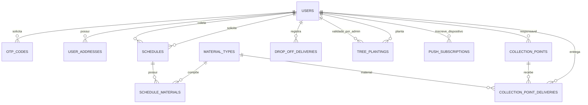

# Banco de Dados

Projeto: Coletaqui Araçoiaba  
Versão: 3.0  
Data: 2026-07-08

## Visão Geral

O Coletaqui usa PostgreSQL com Spring Data JPA/Hibernate. Em desenvolvimento, o schema é atualizado por `JPA_DDL_AUTO=update`. Em produção, recomenda-se usar Flyway ou Liquibase.

## Entidades Principais

- `users`
- `otp_codes`
- `user_addresses`
- `material_types`
- `collection_points`
- `schedules`
- `schedule_materials`
- `collection_point_deliveries`
- `drop_off_deliveries`
- `tree_plantings`
- `push_subscriptions`

## Diagrama Geral



## users

Representa moradores, coletores, pontos de coleta e administradores.

Campos relevantes:

| Campo | Descrição |
| --- | --- |
| `id` | UUID |
| `phone` | telefone único |
| `name` | nome ou empresa |
| `email` | usado para admin |
| `password_hash` | senha admin em BCrypt |
| `role` | `COMMON_USER`, `COLLECTOR`, `ADMIN` |
| `status` | `ACTIVE`, `PENDING_APPROVAL`, `INACTIVE`, `BLOCKED` |
| `profile_complete` | indica cadastro concluído |
| `region` | região de atuação |
| `materials` | materiais coletados ou de interesse |
| `availability` | disponibilidade |
| `collector_service_type` | tipo de atendimento |
| `terms_accepted_at` | data de aceite dos termos |
| `terms_version` | versão dos termos |
| `privacy_accepted_at` | data de aceite da política |
| `privacy_version` | versão da política |
| `created_at` | criação |
| `updated_at` | atualização |

Regras:

- `phone` deve ser único.
- Admin usa `email` e `password_hash`.
- Coletor novo inicia como `PENDING_APPROVAL`.
- Aceite legal é obrigatório ao completar cadastro.

## otp_codes

Armazena OTPs de autenticação.

Campos:

| Campo | Descrição |
| --- | --- |
| `id` | UUID |
| `phone` | telefone solicitado |
| `code_hash` | hash do OTP |
| `channel` | canal de envio |
| `expires_at` | expiração |
| `used_at` | uso |
| `attempts` | tentativas |
| `invalidated` | invalidação por novo OTP |
| `created_at` | criação |

Regras:

- OTP não é salvo em texto puro.
- Novo OTP invalida anteriores.
- OTP expirado, usado ou invalidado não autentica.

## user_addresses

Endereços do morador para coleta domiciliar.

Campos:

| Campo | Descrição |
| --- | --- |
| `id` | UUID |
| `user_id` | usuário |
| `label` | nome do endereço |
| `street`, `number`, `complement` | logradouro |
| `neighborhood` | bairro |
| `city` | cidade |
| `state` | UF |
| `zip_code` | CEP |
| `latitude`, `longitude` | coordenadas opcionais |
| `default_address` | endereço padrão |

Cardinalidade:

- um usuário possui muitos endereços.

## material_types

Catálogo de materiais.

Campos:

| Campo | Descrição |
| --- | --- |
| `id` | UUID |
| `name` | nome |
| `slug` | identificador |
| `description` | descrição |
| `hazardous` | descarte especial |
| `active` | ativo |

Materiais comuns:

- Papel
- Plástico
- Vidro
- Metal
- Óleo de cozinha
- Pilhas
- Baterias
- Orgânico

## collection_points

Pontos fixos de coleta.

Campos:

| Campo | Descrição |
| --- | --- |
| `id` | UUID |
| `name` | nome do ponto |
| `description` | detalhes |
| `address` | endereço |
| `neighborhood` | bairro |
| `city` | Araçoiaba |
| `state` | PE |
| `latitude`, `longitude` | mapa |
| `materials` | materiais aceitos |
| `opening_days` | dias de funcionamento |
| `opening_time`, `closing_time` | horários |
| `responsible_collector_id` | usuário responsável |
| `active` | visibilidade |

Regras:

- ponto ativo aparece no mapa;
- ponto deve ter responsável para confirmar entregas;
- responsável pode ser criado/vinculado pelo telefone informado no admin.

## schedules e schedule_materials

Agendamentos de coleta domiciliar.

Campos principais de `schedules`:

| Campo | Descrição |
| --- | --- |
| `id` | UUID |
| `user_id` | morador |
| `collector_id` | coletor responsável |
| `address_id` | endereço normalizado |
| `address_snapshot` | cópia textual do endereço |
| `preferred_period` | período preferencial |
| `notes` | observações |
| `status` | `REQUESTED`, `ACCEPTED`, `COMPLETED`, `CANCELED` |
| `accepted_at` | aceite |
| `completed_at` | conclusão |
| `canceled_at` | cancelamento |

`schedule_materials` relaciona muitos materiais a uma solicitação.

## collection_point_deliveries

Entregas feitas por moradores em pontos de coleta.

Campos:

| Campo | Descrição |
| --- | --- |
| `id` | UUID |
| `user_id` | morador |
| `collection_point_id` | ponto |
| `material_type_id` | material entregue |
| `responsible_collector_id` | responsável pela confirmação |
| `status` | status da entrega |
| `notes` | observações |
| `delivered_at` | data informada |
| `confirmed_at` | confirmação |

Regras:

- entrega só entra no impacto após confirmação;
- ponto com um único material aceito não precisa perguntar material ao usuário.

## drop_off_deliveries

Registros de entrega avulsa confirmada pelo coletor/ponto, mesmo quando o morador não agendou previamente.

Uso:

- coletor informa telefone do morador;
- sistema vincula a entrega ao usuário existente quando encontrado;
- registro entra no impacto após confirmação.

## tree_plantings

Registros de plantio de árvores.

Campos:

| Campo | Descrição |
| --- | --- |
| `id` | UUID |
| `user_id` | morador |
| `tree_name` | nome opcional |
| `species` | espécie |
| `planted_date` | data do plantio |
| `location_type` | tipo de local |
| `neighborhood` | bairro |
| `location_description` | referência |
| `notes` | observações |
| `photo_url` | foto temporária |
| `photo_path` | caminho interno |
| `latitude`, `longitude` | GPS opcional |
| `status` | `REGISTERED`, `VALIDATED`, `REJECTED` |
| `rejection_reason` | motivo da rejeição |
| `validated_at` | data de validação |
| `created_at`, `updated_at` | auditoria |

Regras:

- foto é obrigatória no registro;
- GPS é opcional;
- admin valida ou rejeita;
- rejeição exige motivo;
- foto é removida após validar ou rejeitar;
- apenas árvores validadas aparecem no mapa público.

## push_subscriptions

Dispositivos inscritos para receber notificações push do PWA.

Campos:

| Campo | Descrição |
| --- | --- |
| `id` | UUID |
| `user_id` | usuário dono do dispositivo |
| `endpoint` | endpoint gerado pelo navegador |
| `p256dh` | chave pública da inscrição |
| `auth` | chave de autenticação da inscrição |
| `user_agent` | identificação do navegador/dispositivo |
| `active` | indica se a inscrição está ativa |
| `created_at`, `updated_at` | auditoria |

Regras:

- um usuário pode ter vários dispositivos inscritos;
- endpoint deve ser único;
- ao desativar notificações, a inscrição é marcada como inativa;
- endpoints expirados ou inválidos devem ser desativados pelo backend.

## Índices Recomendados

- `users(phone)`
- `users(email)`
- `users(role, status)`
- `otp_codes(phone, created_at)`
- `user_addresses(user_id)`
- `material_types(slug)`
- `collection_points(active, city, state)`
- `schedules(user_id)`
- `schedules(collector_id)`
- `schedules(status)`
- `collection_point_deliveries(user_id)`
- `collection_point_deliveries(collection_point_id)`
- `tree_plantings(user_id)`
- `tree_plantings(status)`
- `push_subscriptions(user_id)`
- `push_subscriptions(endpoint)`

## Privacidade

Dados pessoais tratados:

- telefone;
- nome;
- endereço;
- localização opcional;
- histórico de coletas/entregas;
- foto temporária de plantio;
- inscrição push do dispositivo;
- aceite legal.

Regras:

- fotos de plantio não devem permanecer armazenadas após validação/rejeição;
- GPS deve ser opcional;
- aceite legal deve registrar data e versão;
- dados sensíveis não devem aparecer em logs.

## Migrations

Estado atual de desenvolvimento:

```text
JPA_DDL_AUTO=update
```

Recomendação antes de produção:

- introduzir Flyway ou Liquibase;
- gerar migration inicial do schema;
- usar `JPA_DDL_AUTO=validate` em produção.
