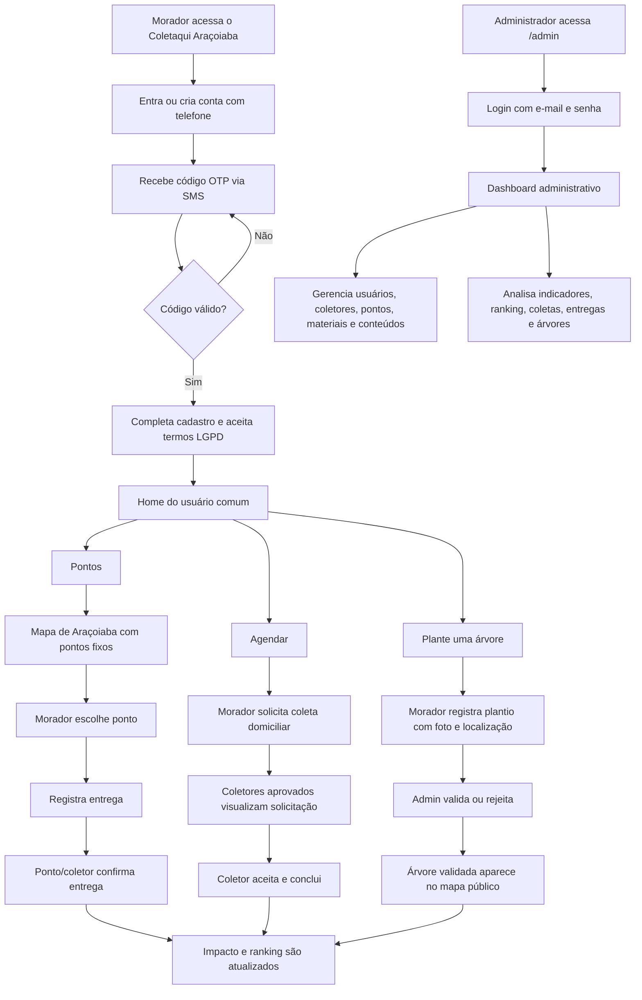
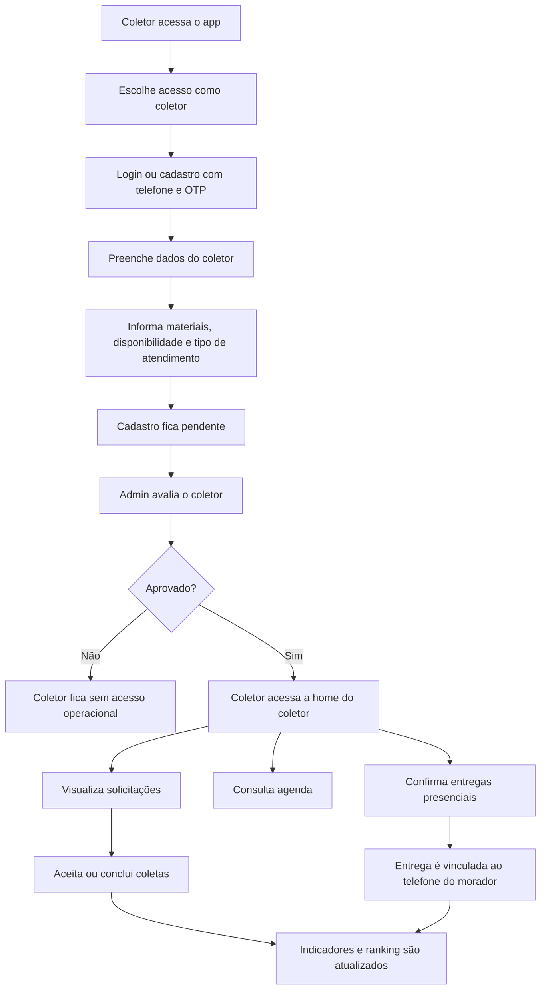
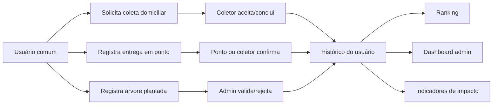

# Manual geral do Coletaqui Araçoiaba

Este documento explica o funcionamento geral do Coletaqui Araçoiaba como um manual de uso e acompanhamento do projeto. Ele serve para o administrador, para a banca/professor da atividade extensionista e para qualquer pessoa que precise entender o fluxo completo do sistema.

## 1. Visão geral

O Coletaqui Araçoiaba é uma plataforma PWA voltada para apoiar a coleta seletiva, o descarte correto de resíduos e ações ambientais na cidade de Araçoiaba-PE.

O sistema conecta moradores, coletores, pontos de coleta e administração em um fluxo único:

- Moradores encontram pontos de coleta, registram entregas, solicitam coleta domiciliar, acompanham seu impacto e participam do ranking.
- Coletores e pontos de coleta recebem solicitações, confirmam coletas e registram entregas feitas presencialmente.
- O administrador acompanha indicadores, valida cadastros, gerencia conteúdos, pontos, materiais, árvores plantadas e ranking.
- A comunidade passa a ter um registro digital das ações ambientais realizadas na cidade.

## 2. Objetivos do projeto

O projeto está alinhado à atividade extensionista e possui três objetivos principais:

1. Mapear pontos de coleta de recicláveis, óleo de cozinha usado, pilhas e baterias.
2. Desenvolver um sistema de agendamento de coleta de recicláveis.
3. Desenvolver relatórios e dashboards para análise de impacto e eficácia da plataforma.

## 3. Papéis do sistema

### Usuário comum

É o morador da comunidade. Ele usa o aplicativo pelo celular para:

- fazer login ou cadastro por telefone;
- aceitar os termos de uso e política de privacidade;
- encontrar pontos fixos de coleta;
- visualizar coletores disponíveis;
- solicitar coleta domiciliar;
- registrar entregas em pontos de coleta;
- acompanhar suas solicitações;
- consultar seu impacto ambiental;
- participar do ranking comunitário;
- registrar plantio de árvores;
- ler dicas, notícias e campanhas ambientais.

### Coletor

É uma pessoa, empresa ou ponto de coleta responsável por receber materiais ou realizar coletas. Ele usa uma área própria, com visual diferente do usuário comum, para:

- cadastrar seus dados;
- informar materiais coletados;
- informar disponibilidade;
- informar se faz somente coleta domiciliar ou também recebe no local;
- aguardar aprovação do administrador;
- visualizar solicitações;
- aceitar ou concluir coletas;
- confirmar entregas feitas diretamente no ponto de coleta.

### Ponto de coleta

É um local fixo onde o morador pode entregar materiais. No sistema, um ponto de coleta pode ser cadastrado pelo administrador e vinculado a um telefone responsável, para que alguém consiga confirmar entregas.

Um ponto pode:

- receber um ou mais materiais;
- possuir endereço visível no mapa;
- ter dias e horários de funcionamento;
- aparecer no mapa com ícone conforme o tipo de material;
- confirmar entregas feitas por moradores.

### Administrador

É quem gerencia a plataforma pelo navegador em tela maior, como computador ou notebook. Ele acessa a área administrativa por login com e-mail e senha.

O administrador pode:

- acompanhar o dashboard geral;
- aprovar, bloquear ou reativar coletores;
- gerenciar usuários;
- gerenciar pontos de coleta;
- gerenciar materiais;
- acompanhar coletas e entregas;
- validar ou rejeitar árvores plantadas;
- informar motivo de rejeição;
- acompanhar ranking;
- gerenciar dicas, notícias e campanhas do carrossel;
- alterar seus próprios dados e senha;
- acompanhar indicadores de impacto.

## 4. Fluxograma geral do sistema

## 5. Fluxo do usuário comum

### 5.1 Entrada e cadastro

1. O morador acessa a tela inicial do Coletaqui Araçoiaba.
2. Clica em "Entrar ou criar conta".
3. Escolhe o acesso como usuário comum.
4. Informa o telefone.
5. O sistema valida o número e envia um código OTP por SMS.
6. O morador digita o código recebido.
7. Se for primeiro acesso, preenche seus dados.
8. O sistema restringe o uso para Araçoiaba-PE.
9. O morador aceita os termos de uso e política de privacidade.
10. Após concluir, entra na home do usuário comum.

### 5.2 Home do usuário comum

Na home, o morador encontra os principais atalhos:

- Como separar: orientações sobre separação de materiais.
- Coletores: lista de coletores e locais que recebem materiais.
- Plante uma árvore: informações, mapa e registro de plantio.
- Ranking: participação comunitária e pontuação.

Também existe um carrossel de dicas, notícias e campanhas. Esse conteúdo é administrável pelo painel do admin.

### 5.3 Pontos

A tela de pontos mostra um mapa de Araçoiaba com locais fixos de entrega.

O morador pode:

1. visualizar pontos próximos dentro da cidade;
2. clicar em um marcador do mapa;
3. ver os dados do ponto abaixo do mapa;
4. abrir navegação pelo Waze;
5. registrar uma entrega naquele ponto.

Quando o ponto aceita apenas um material, o sistema já considera esse material. Quando aceita mais de um, o morador escolhe qual material está entregando.

### 5.4 Agendar coleta

A área de agendamento separa bem três ideias:

- Pontos: locais fixos para entrega.
- Coletores: pessoas ou empresas que fazem coleta ou recebem material.
- Agendar: solicitar coleta domiciliar.

No agendamento, o morador informa:

- material;
- quantidade aproximada;
- endereço;
- melhor dia ou período;
- observações, quando necessário.

Após solicitar, a coleta fica disponível para coletores aprovados. Depois que o coletor aceita e conclui, o impacto do morador é atualizado.

### 5.5 Impacto

A página de impacto reúne o histórico ambiental do morador:

- coletas domiciliares concluídas;
- entregas em pontos de coleta;
- materiais registrados;
- participação no ranking;
- árvores plantadas e validadas.

Essa tela ajuda o morador a perceber sua contribuição para a cidade.

### 5.6 Plante uma árvore

A página de plantio possui:

- orientações simples de como plantar;
- informação sobre retirada de mudas;
- mapa com árvores validadas;
- botão para registrar novo plantio.

No registro, o morador informa dados da árvore, usa localização GPS quando possível e envia uma foto como evidência. A foto fica disponível temporariamente para validação do administrador e depois pode ser removida para reduzir custo e exposição de dados.

## 6. Fluxo do coletor

O coletor só deve operar normalmente após aprovação do administrador. Isso evita que qualquer cadastro novo tenha acesso imediato às solicitações da comunidade.

## 7. Fluxo do administrador

### 7.1 Acesso administrativo

1. O administrador acessa a rota `/admin`.
2. O sistema exibe a tela de login administrativo.
3. O admin informa e-mail e senha.
4. Após autenticação, é direcionado para `/admin/dashboard`.
5. Ao sair, retorna para a tela de login do admin.

O acesso administrativo é separado do fluxo mobile do usuário comum e do coletor.

### 7.2 Dashboard

O dashboard mostra a visão geral da plataforma:

- total de usuários;
- total de coletores;
- coletores pendentes;
- pontos ativos;
- coletas registradas;
- coletas abertas;
- coletas concluídas;
- entregas em pontos;
- árvores validadas;
- árvores pendentes;
- gráficos de evolução e participação.

Essa página serve como painel de acompanhamento da atividade extensionista e do impacto comunitário.

### 7.3 Coletores

Nesta área, o admin acompanha os coletores cadastrados.

Ações esperadas:

- aprovar coletor;
- bloquear coletor;
- reativar coletor;
- visualizar tipo de atendimento;
- conferir materiais aceitos;
- conferir disponibilidade;
- conferir endereço quando recebe material no local.

Um coletor pendente não deve conseguir aceitar coletas nem confirmar entregas como participante ativo.

### 7.4 Usuários

O admin pode consultar usuários cadastrados e acompanhar dados básicos, status e participação.

Essa área ajuda a identificar:

- moradores ativos;
- dados incompletos;
- perfis bloqueados;
- participação em coletas, entregas e plantios.

### 7.5 Pontos de coleta

O admin cadastra e mantém pontos fixos de coleta.

Cada ponto deve conter:

- nome do local;
- telefone responsável;
- endereço;
- cidade e UF, mantendo Araçoiaba-PE;
- latitude e longitude;
- materiais aceitos;
- dias da semana;
- horário inicial e final;
- status ativo ou inativo.

Quando o ponto possui telefone responsável, ele pode ser tratado operacionalmente como um local capaz de confirmar entregas.

### 7.6 Materiais

O admin gerencia os materiais usados no sistema.

Exemplos:

- papel;
- vidro;
- plástico;
- óleo de cozinha;
- pilhas e baterias;
- orgânico, quando aplicável.

Os materiais influenciam filtros, agendamentos, pontos, coletores, entregas e pontuação no ranking.

### 7.7 Coletas e entregas

O admin acompanha o ciclo das solicitações:

- solicitada;
- aceita;
- concluída;
- cancelada.

Também acompanha entregas realizadas diretamente em pontos de coleta. Isso é importante porque nem toda contribuição acontece por agendamento domiciliar.

### 7.8 Ranking

O ranking mostra moradores com maior participação ambiental.

A pontuação considera ações como:

- coleta domiciliar concluída;
- entrega em ponto de coleta;
- materiais com maior impacto ambiental, como óleo e pilhas/baterias;
- árvores plantadas e validadas.

O ranking pode futuramente apoiar campanhas, reconhecimento público ou premiações, caso existam parceiros ou patrocinadores.

### 7.9 Árvores

O admin valida os registros de plantio.

Fluxo:

1. Morador registra uma árvore com dados, localização e foto.
2. O admin analisa as informações.
3. Se estiver correto, aprova.
4. Se não estiver correto, rejeita e informa o motivo.
5. Árvores aprovadas aparecem no mapa público.

Essa validação evita registros indevidos e dá mais credibilidade ao impacto ambiental apresentado.

### 7.10 Dicas, notícias e campanhas

O admin pode gerenciar o conteúdo exibido no carrossel da home.

É possível:

- criar novo conteúdo;
- editar conteúdo existente;
- excluir conteúdo;
- ativar ou desativar;
- informar tipo, como dica, notícia ou campanha;
- adicionar imagem por URL;
- enviar imagem do computador;
- remover imagem enviada;
- adicionar link externo;
- escrever conteúdo interno com formatação básica.

Quando o conteúdo possui texto completo, o usuário pode abrir uma página interna para ler mais.

### 7.11 Minha conta

O admin possui uma área própria para:

- visualizar dados da conta;
- atualizar informações básicas;
- trocar senha.

## 8. Fluxo de dados e impacto

O sistema usa esses registros para transformar ações individuais em indicadores coletivos. Assim, a administração consegue analisar participação, volume de ações e pontos de maior uso.

## 9. Regras importantes

- O projeto é focado em Araçoiaba-PE.
- O cadastro deve manter cidade e UF padronizados para evitar uso fora da região planejada.
- O usuário precisa aceitar termos de uso e política de privacidade.
- O login de usuário comum e coletor usa telefone com OTP via SMS.
- Em desenvolvimento, o OTP pode ser exibido em modo de teste.
- Em produção, o envio real deve ser configurado com provedor de SMS, como Twilio.
- O admin usa login separado com e-mail e senha.
- Coletores precisam de aprovação antes de operar.
- Pontos cadastrados devem ter coordenadas para aparecer corretamente no mapa.
- Fotos de plantio são evidências temporárias e devem ser tratadas com cuidado por LGPD.
- Conteúdos enviados pelo admin podem ter imagem local ou URL externa.

## 10. Rotina sugerida para o administrador

### Todos os dias

- Verificar coletores pendentes.
- Verificar árvores pendentes.
- Acompanhar coletas abertas.
- Conferir se há entregas aguardando confirmação.

### Toda semana

- Revisar ranking.
- Conferir indicadores do dashboard.
- Atualizar dicas, notícias ou campanhas.
- Verificar se pontos de coleta continuam ativos.

### Todo mês

- Exportar ou salvar backup do banco.
- Revisar materiais cadastrados.
- Revisar usuários e coletores bloqueados.
- Levantar dados para relatório da atividade extensionista.

## 11. Problemas comuns e soluções

### O ponto não aparece no mapa

Verifique se o ponto possui latitude e longitude válidas. Sem coordenadas, o sistema pode listar o ponto, mas não consegue posicionar corretamente no mapa.

### O coletor não vê solicitações

Verifique se o coletor foi aprovado pelo admin, se está ativo e se seus materiais/atendimento combinam com a solicitação.

### O usuário não consegue receber OTP

Em desenvolvimento, confirme se a API está rodando. Em produção, confirme a configuração do provedor de SMS.

### A árvore não aparece no mapa público

A árvore precisa ser validada pelo admin. Registros pendentes ou rejeitados não devem aparecer como árvores confirmadas.

### A imagem de notícia ou campanha não aparece

Verifique se foi enviada uma imagem local válida ou se a URL externa está acessível. Ao excluir uma imagem enviada, ela também deve ser removida do armazenamento local.

## 12. Tecnologias usadas

- Frontend: Angular PWA.
- Backend: Java com Spring Boot.
- Banco de dados: PostgreSQL.
- ORM: JPA/Hibernate.
- Documentação da API: Swagger/OpenAPI.
- Containers: Docker Compose com frontend, backend e banco.
- Mapa: Leaflet/OpenStreetMap.
- Autenticação do morador/coletor: OTP via SMS.
- Autenticação do admin: e-mail e senha.

## 13. Resumo final

O Coletaqui Araçoiaba organiza a participação ambiental da comunidade em um fluxo completo:

1. O morador aprende, encontra pontos, agenda coletas, entrega materiais e registra plantios.
2. O coletor ou ponto de coleta confirma as ações realizadas.
3. O administrador valida, acompanha, corrige e analisa os dados.
4. O sistema transforma essas ações em histórico, ranking, mapas e indicadores.

Com isso, o projeto aproxima tecnologia, comunidade e sustentabilidade, fortalecendo a coleta seletiva e a educação ambiental em Araçoiaba-PE.
